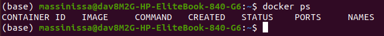
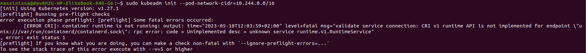
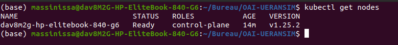

# build-k8s-cluster

<div align="center">
    
</div>

This repository provides a **step-by-step guide** to setting up a **Kubernetes cluster from scratch** on **Ubuntu 20.04**. It walks through installing dependencies, configuring networking, and initializing the cluster.  

🚀 **What’s included?**  
- Installation of **Docker**, **kubeadm**, **kubelet**, and **kubectl**  
- Setting up the **control plane** and **worker nodes**  
- Configuring networking using **Flannel CNI**  
- Troubleshooting common issues  

📌 **Requirements:**  
- Ubuntu 20.04  
- At least **8 CPU / 16GB RAM**  

Follow the instructions below to deploy your Kubernetes cluster! ⬇️  

## Install Docker:
 You can install Docker Engine following the steps given in: https://docs.docker.com/engine/install/ubuntu/

- Test Docker using "docker ps". The "docker ps" command is used to list the running Docker containers on your system. When you run docker ps without any additional options, it displays a list of the currently running containers along with their details, such as the container ID, image name, status, ports, and names. 

<div align="center">
    
</div>


- If you get this error : permission denied while trying to connect to the Docker daemon socket at unix:///var/run/docker.sock: Get "http://\%2Fvar\%2Frun\%2Fdocker.sock/v1.24/containers/json": dial unix /var/run/docker.sock: connect: permission denied, follow the steps: 
    ```bash
    sudo usermod -aG docker $USER 
    newgrp docker
     ```
- The Docker daemon runs as a system service and manages the Docker containers and images on your system. By default, the Docker daemon socket (located at /var/run/docker.sock) has restricted access permissions to ensure the security and integrity of the Docker environment. 
- By adding the user to the "docker" group and activating the new group membership, you grant the user the necessary permissions to access the Docker daemon socket (/var/run/docker.sock). This allows the user to execute Docker commands without encountering the "permission denied" error.

## Installing kubeadm, kubelet and kubectl
The components kubeadm, kubelet, and kubectl are essential for the operation of a Kubernetes (K8s) cluster. You can install kubeadm, kubelet and kubectl following the steps given in: https://kubernetes.io/docs/setup/production-environment/tools/kubeadm/install-kubeadm/

# Build a K8S cluster

A Kubernetes cluster comprises multiple machines called nodes, where each node serves a specific purpose in running and managing containers. The cluster includes a control plane responsible for maintaining the cluster's overall state and orchestrating tasks.


1.  We need to configure the network for each node and to disable swap option and firewall:
```bash
sudo sysctl net.ipv4.conf.all.forwarding=1
sudo iptables -P FORWARD ACCEPT
sudo swapoff -a
sudo ufw disable
```
    
2. Clean the old cluster if it exists: 

```bash
sudo ip link delete flannel.1 
sudo ip link delete cni0 
sudo rm $HOME/.kube/config
sudo modprobe br_netfilter
sudo sysctl net.bridge.bridge-nf-call-iptables=1
sudo systemctl enable docker
```

3.  Reset the Kubernetes node using the following command:

```bash
sudo kubeadm reset
```

The sudo kubeadm reset command is used to completely reset a Kubernetes node that was previously initialized with kubeadm init. This command undoes all changes made to the node during the kubeadm init process, including removing all Kubernetes-related files and configurations.

4. Build a new cluster:

On the master node, run the following command to bootstrap a new Kubernetes cluster. It is used to initialize the control plane on a single node, which includes creating the necessary certificates, configuring the API server, scheduler, and controller manager, and deploying core system components like the etcd key-value store.
```bash[language=bash]
sudo kubeadm init --pod-network-cidr=10.244.0.0/16
```


  - If you face this problem: 
    <div align="center">
    
    </div>
  
    Do this: 
    ```bash[language=bash]
    sudo su
    ```
    Then:
    ```bash[language=bash]
    cat > /etc/containerd/config.toml <<EOF
    [plugins."io.containerd.grpc.v1.cri"]
    systemd_cgroup = true
    EOF
    systemctl restart containerd
    sleep 10
    exit 
    ```
    By these steps, we were modifying the containerd configuration and enabling the systemd cgroup support. By that, we ensured the proper functioning of the container runtime within the Kubernetes cluster. Restarting the containerd service and introducing a brief delay allow the changes to take effect and provide a stable runtime environment for Kubernetes. Finally, run the command again: 

    ```bash
    sudo kubeadm init --pod-network-cidr=10.244.0.0/16
    ```


Then, run the following commands:
```bash
mkdir -p $HOME/.kube
sudo cp -i /etc/kubernetes/admin.conf $HOME/.kube/config
sudo chown $(id -u):$(id -g) $HOME/.kube/config
```

These commands create the necessary directory structure, copy the Kubernetes cluster configuration file to the user's home directory, and ensure that the user has appropriate ownership and permissions for the configuration file. This allows the user to access and manage the Kubernetes cluster conveniently using the kubectl command-line tool.


5. To initialize the network inside your Kubernetes cluster, you need to configure the Container Network Interface (CNI). Several CNI options are available, each offering different capabilities. Here are some commonly used choices:


    1. Weave: Weave creates a virtual network fabric that connects containers across multiple hosts. It provides features such as encryption, IP address management, and automatic container discovery.
    2. Calico: Calico enables secure and scalable networking in Kubernetes. It utilizes standard networking protocols like BGP and provides advanced features like network policy enforcement and integration with external networks.
    3. Flannel: Flannel is a lightweight CNI plugin that offers a simple overlay network for Kubernetes. It assigns a unique subnet to each host and encapsulates network traffic within UDP packets. Flannel is easy to install and suitable for basic networking requirements.
    
In this tutorial, we will use Flannel as the CNI to initialize the network within the Kubernetes cluster. To get started, run the following command:

```bash
kubectl apply -f https://raw.githubusercontent.com/flannel-io/flannel/master/Documentation/kube-flannel.yml
```

6. Run the following command to get some information about the name of each node in the cluster (we have only the master node for the moment), its status (whether it is ready or not), its role (whether it is a worker node or a control plane node).

```bash
kubectl get nodes
```

 We get the following result, where the name of our node is "dav8m2g-hp-elitebook-840-g6", the statut is "Ready", it indicates that the node is ready to receive workloads (otherwise wait few seconds, ruen again "kubectl get nodes", if it is still not ready, use "kubectl describe pod &lt;node-name&gt; to figure out what is the problem), "control-plane" indicates that it is a master node, and "v1.27.1" is the version of Kubernetes that it is running. The "AGE" column indicates how long the node has been running.


<div align="center">
    
</div>


7. Add workers or keep the master as a single-node Kubernetes cluster : once kubeadm init completes successfully, you can join worker nodes to the new Kubernetes cluster using the kubeadm join command. 

By default, the master node in a Kubernetes cluster is "tainted" to prevent workloads from being scheduled on it. This is because it's generally recommended to keep the master node dedicated to running control plane components only, and not running regular workloads. However, there may be situations where you want to run workloads on the master node, such as in a single-node Kubernetes cluster or for testing purposes. In such cases, you can "untaint" the master node so that workloads can be scheduled on it.
To untaint the master node, you can use the kubectl taint command. Here's an example of how to do it:

   - First, check the current taints on the master node by running the following command:
       ```bash[language=bash]
       kubectl describe node <master-node-name>
       ```
       Replace &lt;master-node-name&gt; with the actual name of your master node.

   - Look for the line that says Taints: and note the name of the taint that starts with node-role.kubernetes.io/master. For example:
       ```bash[language=bash]
       Taints:     node-role.kubernetes.io/master:NoSchedule
       ```
       In this case, the taint name is node-role.kubernetes.io/master.
   - Use the kubectl taint command to remove the taint from the master node:
       ```bash[language=bash]
       kubectl taint nodes <master-node-name> node-role.kubernetes.io/master-
       ```

      Replace &lt;master-node-name&gt; with the actual name of your master node, and append a - at the end of the taint name to remove it.
      That's it! Now the master node is no longer tainted and workloads can be scheduled on it. Note that this is generally not recommended in production environments, as it can impact the stability and performance of the control plane components running on the master node.


